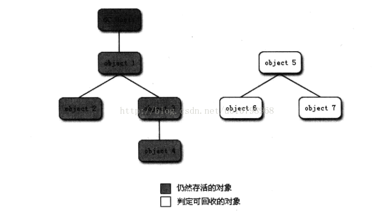
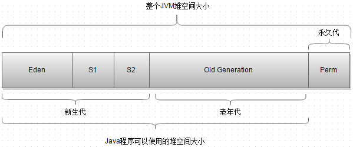

+++
title = "什么是GC Roots"
date = 2019-12-03T01:07:47+08:00
draft = false
tags = ["java","gc"]
categories = ["Java"]
+++

# GC Root
我们常说的GC root，特指垃圾回收器的对象，GC会收集不是GC root且没有被gc root引用的对象。
一个对象可以有多个gc root，有以下几种：
 
 - 虚拟机栈中引用的对象
 - 类的静态属性引用的对象
 - 常量对象
 - 本地方法栈中的JNI（java Nativa方法）中引用的对象

在 JDK 1.8中移除整个永久    代，取而代之的是一个叫元空间（Metaspace）的区域（永久代使用的是JVM的堆内存空间，而元空间使用的是物理内存，直接受到本机的物理内存限制）。
