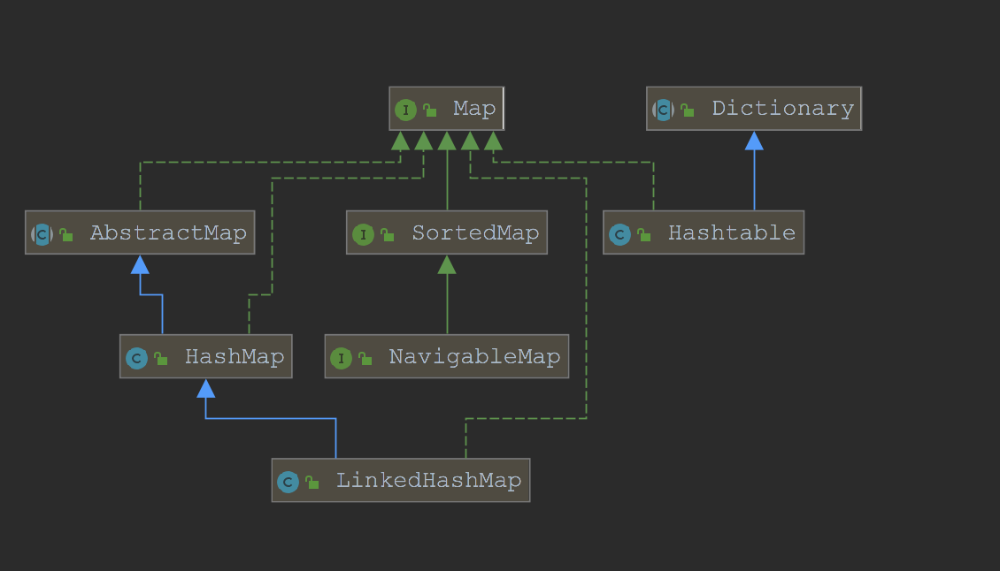

+++
title = "Java Hashmap"
date = 2019-12-04T17:17:49+08:00
draft = true
tags = [""]
categories = [""]
comments = true
share = true
+++

1. Map类继承关系

上面展示了java中Map的继承图，Map是一个接口，我们常用的实现类有HashMap、LinkedHashMap、TreeMap，HashTable。HashMap根据key的hashCode值来保存value，需要注意的是，HashMap不保证遍历的顺序和插入的顺序是一致的。HashMap允许有一条记录的key为null，但是对值是否为null不做要求。HashTable类是线程安全的，它使用synchronize来做线程安全，全局只有一把锁，在线程竞争比较激烈的情况下hashtable的效率是比较低下的。因为当一个线程访问hashtable的同步方法时，其他线程再次尝试访问的时候，会进入阻塞或者轮询状态，比如当线程1使用put进行元素添加的时候，线程2不但不能使用put来添加元素，而且不能使用get获取元素。所以，竞争会越来越激烈。相比之下，ConcurrentHashMap使用了分段锁技术来提高了并发度，不在同一段的数据互相不影响，多个线程对多个不同的段的操作是不会相互影响的。每个段使用一把锁。所以在需要线程安全的业务场景下，推荐使用ConcurrentHashMap，而HashTable不建议在新的代码中使用，如果需要线程安全，则使用ConcurrentHashMap，否则使用HashMap就足够了。
LinkedHashMap属于HashMap的子类，与HashMap的区别在于LinkedHashMap保存了记录插入的顺序。TreeMap实现了SortedMap接口，TreeMap有能力对插入的记录根据key排序，默认按照升序排序，也可以自定义比较器，在使用TreeMap的时候，key应当实现Comparable。