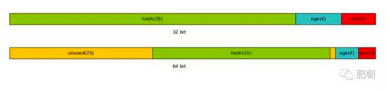

+++
title = "Java Object Size"
date = 2019-12-05T12:06:03+08:00
draft = false
tags = ["java"]
categories = ["Java"]
comments = true
share = true
+++

阅读本文大概需要 2.8 分钟。

出处：http://u6.gg/swLPg

编写 Java 代码的时候，大多数情况下，我们很少关注一个 Java 对象究竟有多大(占据多少内存)，更多的是关注业务与逻辑。

但是殊不知，在我们不经意间，大量的内存被无形地浪费了。

## 一个 Java 对象到底有多大？

想要精确计算一个 Java 对象占用的内存，首先要了解 Java 对象的结构表示。

## Java 对象结构

一个 Java 对象在 Heap 的表示，可以分为三部分：

* Object Header

* Class Pointer

* Fields

每个普通 Java 对象在堆(heap)中都有一个头信息(object header)，头信息是必不可少的，记录着对象的状态。

32 位与 64 位占用空间不同，在 32 位中：

<pre class="juejin-editor-highlight">
hash(25)+age(4)+lock(3)=32bit
</pre>

64 位中：

<pre class="juejin-editor-highlight">
unused(25+1)+hash(31)+age(4)+lock(3)=64bit
</pre>

我们知道，在 Java 中，一切皆对象；每个类都有一个父类， ClassPointer 就是当前对象父类的一个指针。

在 32 位系统中，这个指针为 4byte；

在 64 位系统中，如果开启指针压缩(-XX:+UseCompressedOops)或者 JVM 堆的最大值小于 32G，这个指针也是 4byte，否则是 8byte。

关于字段(Fields)，这里指的是类的实例字段；也就是说不包括静态字段，因为这个字段是共享内存的，只会存在一份。

下面以 32 位系统为例子，计算一下 java.lang.Integer 到底占用多大内存：

ObjectHeader 和 Pointer 都是固定的，4+4=8byte 。

再看看字段，只有这一个，表示数值：

<pre class="juejin-editor-highlight">
/** * The value of the <code>Integer</code>. * * @serial */private final int value;
</pre>

一个 int 在 java 中占据 4byte，所以 Integer 的大小为 4+4+4=12byte。

这个结果对吗？

不对！

还有一点没有说： 在 java，对象占用的 heap 大小是 8 位对齐的，上面的 12byte 没有对齐，所以需要补位 4byte。结果是 16byte！

另外，在 Java中 还有一种特殊的对象， 数组！

没错，这个对象有点特殊，它比其他对象多了一个属性：长度(length)。

所以我们计算数组长度的时候，需要额外加上一个长度的字段，即一个 int 的大小。

例如：int[] arr = new int[10];

arr 的占用 heap 大小为：

4(object header)+4(pointer)+4(length)+4*10(10个int大小)=52byte 由于需要 8 位对齐，所以最终大小为 56byte。

## 节约内存原则

在了解了对象的内存使用情况后，我们可以简单算一笔帐。

一个 java.lang.Integer 占用 16byte，而一个 int 占用 4byte，4:1 的比例。

也就是说整数的类类型是基本类型内存的 4 倍！

由此我们得出第一个节约内存的原则：

(1) 尽量使用基本类型，而不是包装类型。

数据库建表的时候字段类型需要仔细推敲，同样 JavaBean 中的属性字段类型也需要仔细斟酌。

不要吝啬使用 short，byte，boolean，如果短类型能放下数据，尽量不要使用更长的类型。

一个 long 比一个 int 才多 4byte，但是你要想，如果内存中有 100W 个 long，那就白白浪费了约 4MB 空间，不要小看这一点点的空间浪费，因为随便一个跑着在线应用的 JVM 中，对象都能达到上千万！

内存是节省出来的。

(2) 斟酌字段类型，在满足容量前提下，尽量用小字段。

你知道一个 ArrayList 集合，如果里面放了 10 个数字，占用多少内存吗？

让我们算算：

ArrayList 中有两个字段：

<pre class="juejin-editor-highlight">
/** * The array buffer into which the elements of the ArrayList are stored. * The capacity of the ArrayList is the length of this array buffer. */private transient Object[] elementData;/** * The size of the ArrayList (the number of elements it contains). * * @serial */private int size;
</pre>

Object Header 占 4byte，Pointer 占 4byte，一个 int 字段(size)占 4byte，elementData 数组本身占 12(4+4+4)，数组中 10 个 Integer 对象占 10×16。

所以整个集合空间大小为 4+4+4+12+160=184byte。

如果我们用 int[] 代替集合呢，12+4×10=52byte，对其后 56byte。

集合跟数组的比例是 184:56，超过 3:1 了！

(3) 如果可能，尽量用数组，少用集合。

数组中是可以使用基本类型的，但是集合中只能放包装类型！

如果实在需要使用集合，推荐一个比较节约内存的集合工具， fastutil。

这里面包含了 JKD 集合中绝大部分的实现，而且比较省内存。

## 小技巧

在上面的三个原则基础上，提供两个小技巧。

* 时间用 long/int 表示，不用 Date 或者 String。

* 短字符串如果能穷举或者转换成 ascii 表示，可以用 long 或者 int 表示。

注意：小技巧跟具体的场景数据有关系，可以根据实际情况进行激进优化节省内存。

## 总结

性能和可读性向来就有些矛盾，在这里也是，为了节约内存，不得不进行取舍，代码丑陋了一些，可读性差了一些，还好能省下一些内存。

上面的原则在确实需要节约内存的时候 ，不妨可以试试！