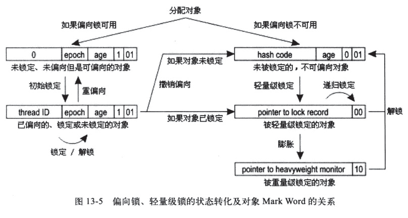

+++
title = "锁优化：逃逸分析、自旋锁、锁消除、锁粗化、轻量级锁和偏向锁"
date = 2019-12-03T16:20:10+08:00
draft = false
tags = ["synchronzied锁", "java""]
comments = true
share = true
+++

1. 逃逸分析 Escape Analysis
1.1 逃逸分为两种：
方法逃逸：当一个对象在方法中被定义后，可能作为调用参数被外部方法说引用。
线程逃逸：通过复制给类变量或者作为实例变量在其他线程中可以被访问到。
1.2 逃逸分析相关优化
如果证明一个对象不会逃逸方法外或者线程外，则可针对此变量进行一下三种优化：

栈上分配stack allocation：如果对象不会逃逸到方法外，则对此对象在栈上分配内存，则对象所占用的空间可以随栈出栈而别销毁。

同步消除synchronization Elimination：如果一个对象不会逃逸出线程，则对此变量的同步措施可消除。
Scalar replacement：标量scalar是不可再分解的量，比如基本数据类型，聚合量Aggregate是可以在被分解的，比如java中的对象。标量替换是将一个聚合量拆散，根据程序对此聚合量的访问情况，将其使用到的成员变量恢复到原始变量来访问就是标量替换。==逃逸分析如果证明一个对象不会被外部访问，并且此对象可以被拆散，则程序执行时可能不会创建此对象==。

1.3 参数开启
-XX:+DoEscapeAnalysis开启逃逸分析；
-XX:+EliminateLocks开启同步消除；
-XX:+EliminateAllocations开启标量替换；
2.自旋锁
线程等待的方式有两种，挂起和自旋。

挂起操作需要进行线程调度，访问==jvm和操作系统共享的数据结构==，而且线程初次启动可能其所需数据不再处理器本地缓存中，由此也会引发一些开销和缓存的缺失。

如果此线程想要获取的锁往往很快可以释放，就让其采取“本地自旋”操作。

如下是TASLock及其测试类示例代码：

TASLock
/**
 * Tast And Set Loc：测试-设置锁
 *
 * 自旋状态时，每次尝试获取锁，都采用了CAS(check and set)操作，
 * 不断的设置锁标志位—当锁标志位可用时，一个线程拿到锁，其他线程仍然自旋
 *
 * TODO 缓存一致性流量风暴
 *
 * fixme AtomicBoolean保存状态，使用其getAndSet()方法判断锁状态并尝试获取锁
 */
public class TASLock implements Lock {
    //初始值为false；
    private AtomicBoolean mutex=new AtomicBoolean(false);

    @Override
    public void lock() {
        //返回之前的值，并设置为true fixme 如果之前未true则进入自旋状态
        //fixme mutex之前状态时FALSE时才返回，表示获取到锁
        //原子变量的改动对所有线程都可见
        while(mutex.getAndSet(true)){}
    }
    
    @Override
    public void unlock() {
        mutex.set(false);//fixme ?释放锁？
    }
}
计时类
/**
 * 计时类
 */
public class TimeCost implements Lock {

    //实现时使用的是自旋锁
    private final Lock lock;

    public TimeCost(Lock lock) {
        this.lock = lock;
    }

    @Override
    public void lock() {
        long start=System.nanoTime();
        lock.lock();
        long duration=System.nanoTime()-start;

        System.out.println(lock.toString()+"time cost is "+duration);
    }

    @Override
    public void unlock() {
        lock.unlock();
    }
}
驱动类
public class TASLockMain {
    private static TimeCost timeCost=new TimeCost(new TTASLock());
//  private static TimeCost timeCost=new TimeCost(new TASLock());

    public static void func(){
        timeCost.lock();
        timeCost.unlock();
    }

    public static void main(String[] args) {
        for (int i = 0; i < 10000; i++) {
            Thread t=new Thread(()-> func());
            t.start();
        }

    }
}
3.同步消除：锁消除Lock Elision、锁粗化Lock Coarsening
锁消除：虚拟机的运行时编译器在运行时如果检测到一些要求同步的代码上不可能发生共享数据竞争，则会去掉这些锁。

锁粗化：将临近的代码块用同一个锁合并起来。

参数设置:-XX:+EliminateLocks。

消除无意义的锁获取和释放，可以提高程序运行性能。

4.轻量级锁
轻量级锁提升性能的依据是“绝大多数同步的锁都是不存在竞争的”，对于竞争的情况轻量级锁比传统的重量级锁更慢。

-XX:+UseHeavyMonitors可以禁用轻量级锁和偏向锁。

4.1 对象头及其他
HotSpot虚拟机对象头object header分为两部分信息：

mark word 对象自身的运行时信息，例如哈希码hascode、GC分代年龄(generational GC age)。是实现轻量级锁和偏向锁的关键；
存储指向==方法区==中指向对象类型数据的指针；
如果是数组的话还有有额外的部分存放数组长度；
轻量级锁相对于使用操作系统互斥量的互斥锁(重量级锁)synchronized、Lock而言的，使用CAS操作实现。

对象头中的mark word

4.2 同步：加锁与解锁
加锁过程大致分为三步：

代码进入同步块时，检测同步对象如果没有被锁定(01),则虚拟机首先在当前线程的栈帧中建立名为锁记录Lock Recode的空间(虚拟机栈为线程独享，栈帧为其栈元素)，并拷贝锁对象对象头的mark word部分。
虚拟机使用CAS操作尝试将对象的mark word更新为指向栈帧的lock recode的指针，成功更新着此线程拥有了此锁对象的锁，并且==对象的锁标记更新为00，此对象处于轻量级锁的状态==。如图所示：

如归CAS更新操作失败了，则虚拟机检查锁对象的mark word是否指向当前线程的栈帧，是则说明线程已经拥有此对象锁，进入同步代码块执行， ==否则说明锁对象被其他线程抢占，两条以上的线程争用一个锁，轻量级锁膨胀为重量级锁，锁对象状态值变为10，锁对象mark down存储的是指向重量级锁/互斥量/互斥锁的指针==，等待锁的线程会进入阻塞状态。
解锁过程也是通过CAS操作：

把把锁对象的mark word和线程的栈帧中复制的mark word替换回来，成功者同步完成；
失败说明有其他线程尝试获取该锁，则在释放锁的同时唤醒挂起的线程。
5.偏向锁 biased lock
偏向锁更近一步，在无竞争的情况下直接把整个同步消除掉。如果程序大多数锁总是被多个线程访问则没必要开启。-XX:+UseBiasedLocking开启偏向锁。

5.1 获取偏向锁过程
锁对象第一次被线程获取时，使用CAS操作把获取这个锁的线程id记录在mark word中，并更改标志位01，成功则此线程持有偏向锁，持有偏向锁的线程每次进入锁对象相关的代码块时，虚拟机都不会进行任何同步操作；
另一个线程尝试获取这个锁时，偏向锁撤销。如果锁对象未被锁定则恢复到未被锁定状态，如果此对象正在被锁定则变成轻量级锁。
5.2 偏向锁、轻量级锁、重量级锁/互斥锁 状态转换图

